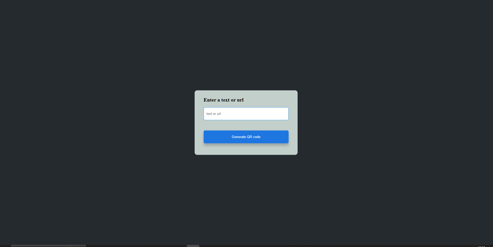
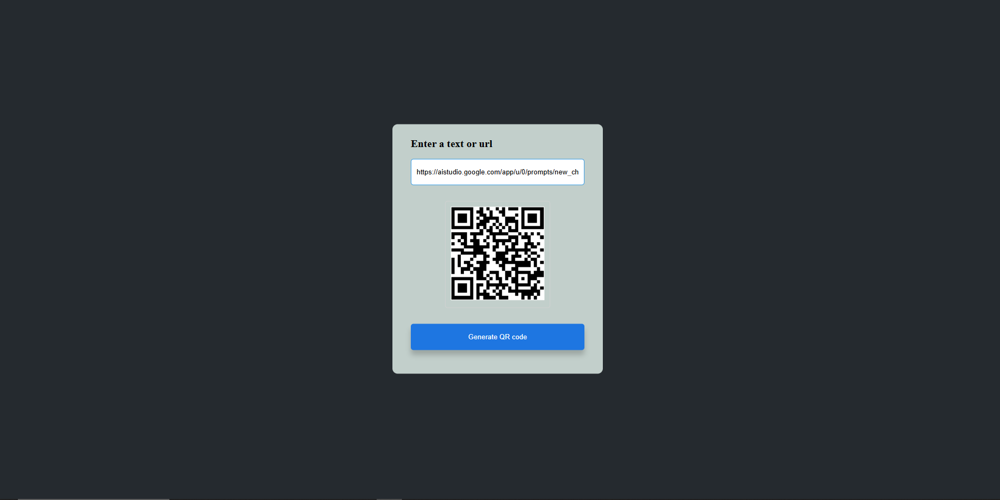

# QR Code Generator

A simple and elegant web application to generate QR codes from any text or URL.

## Overview

This project provides a user-friendly interface to quickly create QR codes. Simply enter your desired text or URL, and the application will generate a scannable QR code for you.

## Features

* **Easy to Use:** Clean and intuitive design for effortless QR code generation.
* **Versatile Input:** Accepts both plain text and website URLs.
* **Real-time Generation:** The QR code updates instantly as you type.
* **Clear Display:** The generated QR code is displayed prominently.
* **Error Handling:** Provides visual feedback if you try to generate a QR code without entering any text.
* **Stylish Design:** A visually appealing interface with a modern aesthetic.

## Technologies Used

* **HTML:** For structuring the web page.
* **CSS:** For styling the user interface.
* **JavaScript:** For handling user input and interacting with the QR code generation API.
* **QR Server API:** A free online API used to generate the QR code images.

## How to Use

1.  Open the `index.html` file in your web browser.
2.  In the input field labeled "Enter a text or url", type or paste the text or URL you want to encode in the QR code.
3.  As you type, the QR code will be generated and displayed in the box below the input field.
4.  You can then scan the QR code with your smartphone or QR code reader application.

## Project Structure

```
├── index.html     // The main HTML file
├── index.css      // The CSS file for styling
└── index.js       // The JavaScript file for functionality
```

## Screenshots




## Contributing

Contributions are welcome! If you find any issues or have suggestions for improvements, please feel free to open a pull request.

## Acknowledgements

* Uses the free [QR Server API](https://goqr.me/) for QR code generation.

---
